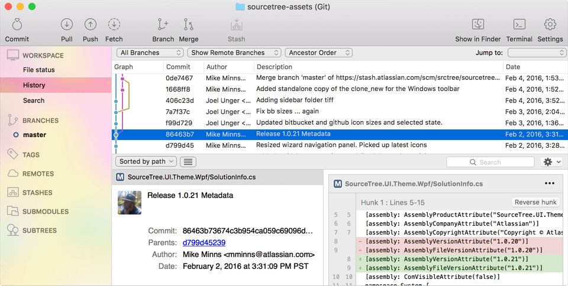

# 認識 VCS（版本控制系統）

版本控制是現代軟體專案開發最基本且重要的環節；儘管如此，台灣仍有許多公司並不重視或尚未成功導入版本控制，因此衍生出不少問題。創科資訊迄今已輔導不少開發團隊，正確地認識並使用版本控制系統，我們也希望有更多人可以在學生時期，就對版本控制有正確的認識並儘早開始使用。

> 版本控制（Revision control）是維護工程藍圖的標準作法，能追蹤工程藍圖從誕生一直到定案的過程。此外，版本控制也是一種軟體工程技巧，藉此能在軟體開發的過程中，確保由不同人所編輯的同一程式檔案都得到同步。（出自維基百科）

## 為什麼需要版本控制系統？

在專案開發的過程中，程式和文件會不斷地產出，每一次的修改都會覆蓋掉舊的檔案內容。

1. 檔案可能被自己或其他人覆蓋，或是被刪除。
2. 被修改過的檔案，哪些地方被修改？被誰修改？差異在哪裡？
3. 如何還原至上一次甚至上上一次修改前的內容？

利用遠端伺服器進行版本控制，還會有備份的好處，當電腦故障或硬碟毀損時，可以輕鬆復原避免辛苦產出的成果付之一炬。

## 有哪些版本控制系統？

常見有 SVN（Subversion）、Git 與 Mercurial 等，有些較古老的專案也可能使用 CVS 等工具。

## 開始使用版本控制系統

GitHub 與 Bitbucket 是目前最受歡迎的免費 VCS 服務，都非常適合入門者使用。

我們建議先從 GitHub 開始。

首先，請先註冊一組 GitHub 帳號（請放心！註冊帳號是完全免費且不需要填信用卡號）：

https://github.com/signup/free

註冊完 GitHub 帳號，即可擁有一個帳號專屬的個人頁面，例如：

https://github.com/lyhcode/

這個頁面會記錄你在 GitHub 參與、貢獻過哪些專案，因此有許多軟體公司在召募新人時，都會特別注意應聘者的 GitHub 個人頁面，以判斷其是否對軟體開發有足夠的熱忱。

## 安裝並使用 SourceTree

SourceTree 是免費的 Git 圖形化工具，對初學者來說更友善，而且提供清楚的版本分支視覺化呈現方式。

https://www.sourcetreeapp.com/



## 認識 Git 基礎指令

* [Git 基本操作](https://ihower.tw/git/basic.html)
* [連猴子都能懂的 Git 入門指南](https://backlogtool.com/git-guide/tw/reference/basic.html)

常見 Git 詞彙：

1. repository
2. branch
3. tag
4. clone
5. fork
6. commit
7. checkout
8. pull / push

學習 Git 基本指令的免費線上課程：

* [TryGit](https://try.github.io/)
* [CodeCademy](https://www.codecademy.com/learn/learn-git)
* [CodeSchool](https://www.codeschool.com/learn/git)

## 作業

請利用 GitHub 的 Fork 功能將 `hello-git` 專案複製到你的 GitHub 個人帳號下。

例如：

```
https://github.com/trunk-studio/hello-git
```

複製到

```
https://github.com/YourName/hello-git
```

請利用 `git` 指令或 SourceTree 將 `hello-git` repository clone 到你的電腦本地端。

1. 請在專案中新增一個資料夾，並且以你的學號或 GitHub 帳號命名。
2. 請在新資料夾中新增 `README.md` 文字檔，並且利用 Markdown 格式撰寫個人簡介與本日學習心得。
